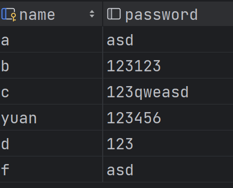
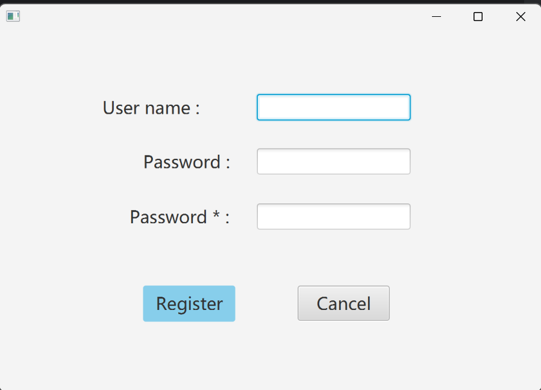
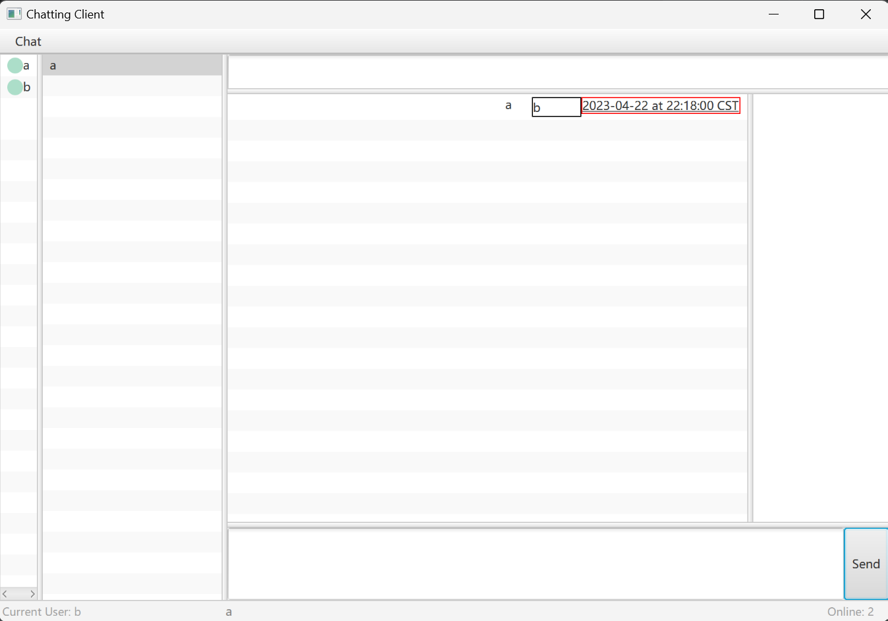

# 🫧 Chatting

### 1.User information storage (Login and registration)
   Use sqlite database to storage the users' information.

   Here are some user template used for testing.

   Or you can register a new user in the registration UI.

### 2.User interface

For the UI part, we can find the whole interface is splitted into for main parts: users sheet, recent chat, current dialog and group members list, from left to right.

On the bottom, you can find the Current login user, current chat mate and online users count from left to right.

There is also a blank area above the dialog part and group member list used as notification area.(When you receive message from another user or a group, you will note it there)

